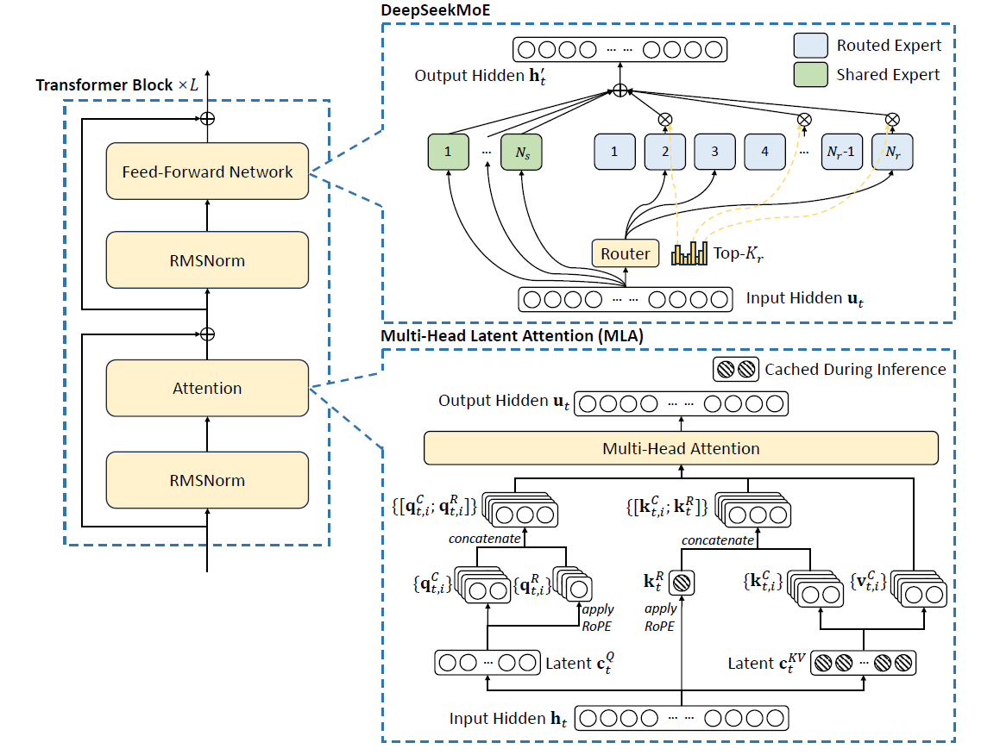
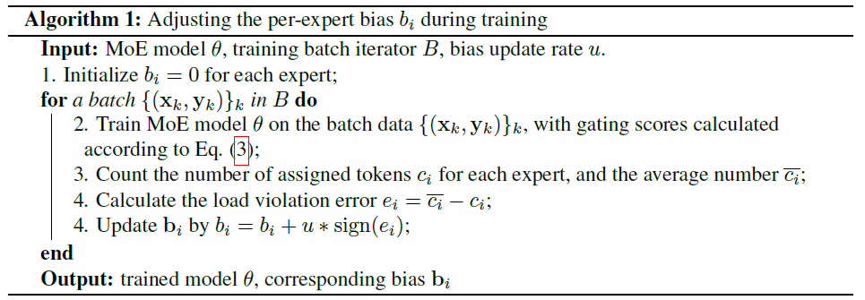

Recap: DeepSeek-V1's MoE
=====

DeepSeek-V1 introduced a Shared Expert MoE architecture with two key modules:
1. Fine-Grained Expert Segmentation
   - Splits experts into smaller, specialized sub-experts to handle distinct knowledge domains.

2. Shared Expert Isolation

   - Isolates shared knowledge into dedicated "generalist" experts to prevent redundancy.


DeepSeek-V3: Tackling Load Balancing
====
V1/V2 relied on auxiliary losses to balance workloads across experts.

**The Problem with Auxiliary Losses:**

Auxiliary losses penalize imbalanced token-to-expert assignments, but overly aggressive loss terms can:

- Interfere with the main training objective, degrading model performance.

- Introduce hyperparameter tuning challenges (e.g., balancing loss weights).

This creates a trade-off: Better load balancing vs. Preserving model quality.

**V3’s Goal:**
Eliminate auxiliary losses while achieving automatic, stable load balancing – ensuring experts receive balanced workloads without disrupting the primary training task.


**Auxiliary Loss Free Load Balancing**

DeepSeek-V3 introduces a novel mechanism called Auxiliary Loss Free Load Balancing (ALFLB) to address the load balancing issue in MoE models.


Each expert is assigned a dynamic bias term $b_i$, which is added to its affinity scores $s_{i, t}$ during token routing.

The top-K experts are selected based on the adjusted scores $g^{\prime}_{i,t}$:

$$
g^{\prime}_{i,t} =
\left\{
  \begin{array}{ll}
		s_{i, t},& \ s_{i, t}+b_i \in \mathrm{Topk}(\{ s_{j, t}+b_j | 1\leq j \leq N_r \}, K_r)\\
		0,& \mathrm{otherwise}\\
  \end{array}
\right.
$$

- When an expert is overloaded, its bias $b_i$ is reduced, lowering its gating weight and routing fewer tokens to it.
- When an expert is underloaded, its bias $b_i$ is increased, boosting its gating weight and routing more tokens to it.

To ensure balanced token distribution, we monitor **whether experts are overloaded or underloaded**.

- $c_i$: Number of tokens assigned to expert $i$.
- $\bar{c_i}$: Average number of tokens per expert.

Measure the deviation from the ideal load by 
$$
e_i = c_i - \bar{c_i}.
$$

- $e_i > 0$: Expert $i$ is overloaded.
- $e_i < 0$: Expert $i$ is underloaded.



**Dynamic Bias Adjustment**

- **Initialization:** Biases $b_i$ are initialized to 0.
- **Bias Update Rule:**
  - $b_i \leftarrow b_i + u \cdot \mathrm{sign}(e_i)$, where $u$ is a small update step.

Overloaded experts receive fewer tokens, while underloaded experts receive more. 

This dynamic adjustment ensures balanced workloads without backpropagation or significant additional computational cost.

A small auxiliary loss (with minimal weight) is still retained to ensure stable convergence.


Todo:
```
code...
```

References:
=====

[1] DeepSeekMoE: Towards Ultimate Expert Specialization in Mixture-of-Experts Language Models. https://arxiv.org/abs/2401.06066

[2] DeepSeek-V3 Technical Report. https://arxiv.org/abs/2412.19437

[3] Auxiliary-Loss-Free Load Balancing Strategy for Mixture-of-Experts. https://arxiv.org/abs/2408.15664
